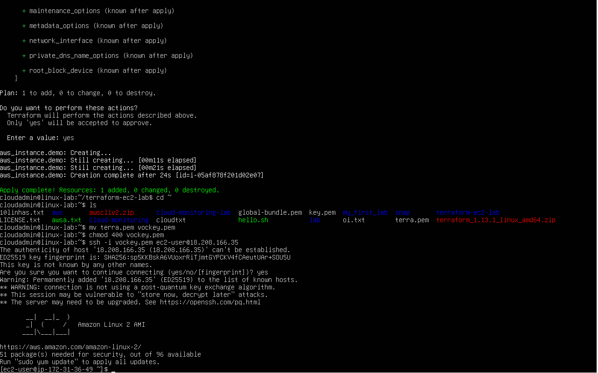
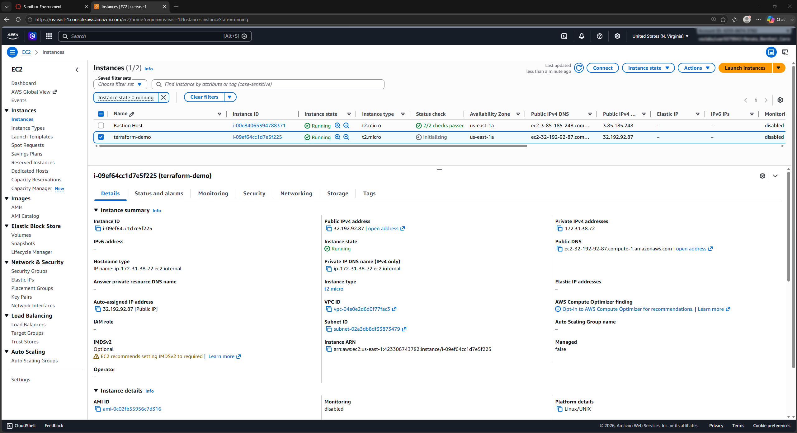
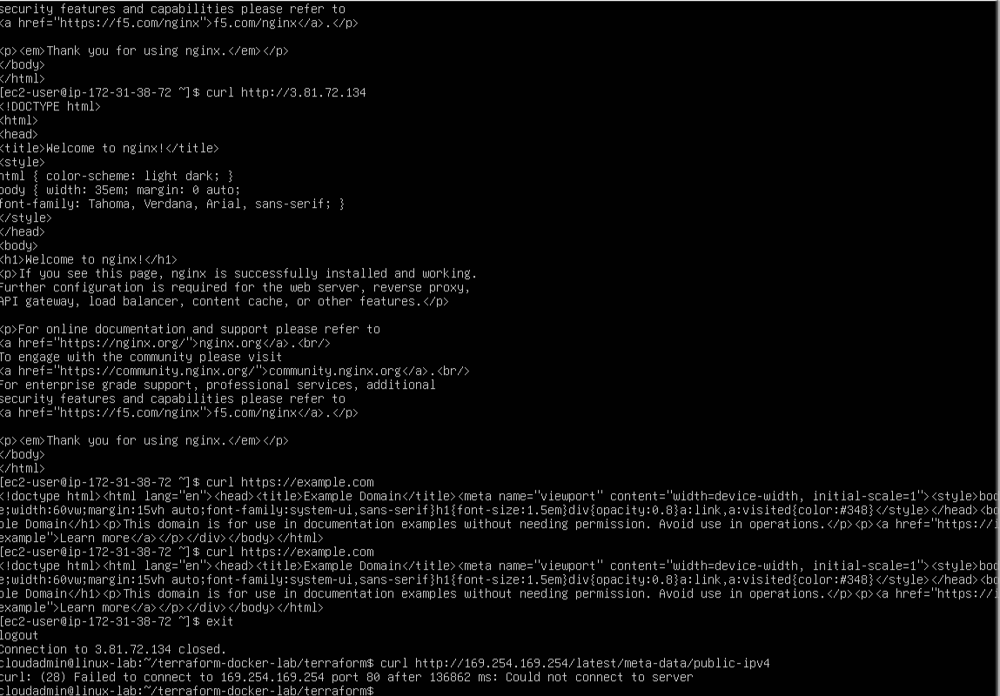
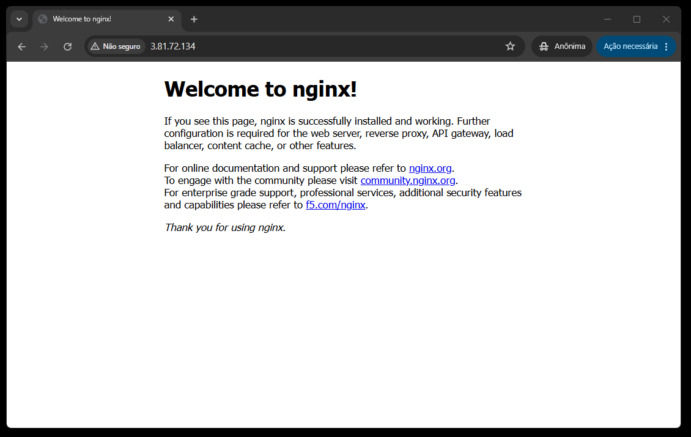
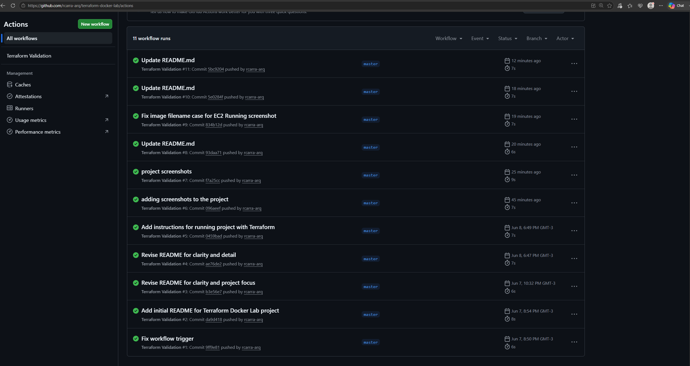

## Terraform Docker Lab — AWS Infrastructure

## Overview

Provisioned an AWS EC2 instance using Terraform (IaC) and deployed a Dockerized Nginx web server accessible via public IP. Includes CI validation with GitHub Actions.
Part of my Cloud Computing and DevOps learning journey, focusing on Infrastructure as Code, containerization, and automation.


---

## Technologies

* AWS (EC2, Security Groups, VPC)
* Terraform (Infrastructure as Code)
* Docker (Containerization)
* GitHub Actions (CI automation)
* Linux (Ubuntu)
* Git & GitHub
---

## Arquitecture

Terraform → AWS Provider → Instância EC2 → Docker → Nginx (porta 80)

---

## Features

* Infrastructure provisioned as code with Terraform
* Automated EC2 deployment
* Dockerized Nginx web server with public access via port 80
* CI validation on push with GitHub Actions

---

## Project Structure

```text
terraform-docker-lab/
├── terraform/
│   ├── main.tf
│   ├── variables.tf
│   ├── outputs.tf
│
├── .github/
│   └── workflows/
│       └── terraform-check.yml
│
├── README.md
└── .gitignore
```
## Screenshots

### Terraform Apply


### EC2 Running


### Nginx Validation


### Nginx Page


### GitHub Actions (CI Pipeline)


---

## CI/CD (GitHub Actions)

This repository includes a GitHub Actions workflow that runs automatically on each push.

Current workflow:

* Checkout repository
* Validate Terraform configuration

---

## Learning Objectives

* Infrastructure as Code (Terraform)
* AWS cloud resource provisioning
* CI/CD fundamentals with GitHub Actions
* Docker container deployment
* Git-based development workflow

---
## How to Run This Project

This section explains how to reproduce the infrastructure locally using Terraform.

---

### 1. Prerequisites

Make sure you have installed:

* AWS CLI configured (`aws configure`)
* Terraform installed
* Git installed
* An AWS account with permissions to create EC2 resources

---

### 2. Clone the Repository

```bash id="x1p9kq"
git clone https://github.com/rcarra-arq/terraform-aws-ec2-lab.git
cd terraform-aws-ec2-lab/terraform
```

---

### 3. Initialize Terraform

```bash id="q7v2lm"
terraform init
```

This downloads the required providers (AWS).

---

### 4. Review the Execution Plan

```bash id="m4k9tz"
terraform plan
```

This shows what resources will be created in AWS.

---

### 5. Deploy Infrastructure

```bash id="c8v1nx"
terraform apply
```

Type `yes` when prompted to confirm deployment.

---

### 6. Access the EC2 Instance

After deployment, Terraform will output the public IP.

Use it to connect:

```bash id="p3t8qj"
ssh -i your-key.pem ubuntu@<PUBLIC_IP>
```

Or access the web server (if Docker/Nginx is running):

```
http://<PUBLIC_IP>:80
```

---

### 7. Destroy Resources (Important for cost control)

```bash id="r6n2vk"
terraform destroy
```

Type `yes` to remove all created resources.

---

## Notes

* Always run `terraform destroy` to avoid unnecessary AWS costs.
* Ensure your `.pem` key has correct permissions:

```bash id="t9x4lm"
chmod 400 your-key.pem
```

* AWS credentials must be configured locally before running Terraform.


## Author

Renata C.
Cloud Computing career transition focused on AWS, Infrastructure, and DevOps practices.

---
---

PT/BR
# Terraform Docker Lab — Infraestrutura AWS

## Visão Geral

Provisionamento de uma instância EC2 na AWS utilizando Terraform (IaC) e deploy de um servidor web Nginx conteinerizado com Docker, acessível via IP público. Inclui validação de CI com GitHub Actions.
Parte da minha jornada de aprendizado em Cloud Computing e DevOps, com foco em Infraestrutura como Código, conteinerização e automação.


---

## Tecnologias

* AWS (EC2, Security Groups, VPC)
* Terraform (Infraestrutura como Código)
* Docker (Conteinerização)
* GitHub Actions (automação de CI)
* Linux (Ubuntu)
* Git & GitHub

---
## Arquitetura

Terraform → AWS Provider → Instância EC2 → Docker → Nginx (porta 80)

---
## Funcionalidades

* Infraestrutura provisionada como código com Terraform
* Deploy automatizado de instância EC2
* Servidor web Nginx conteinerizado com acesso público via porta 80
* Validação de CI a cada push com GitHub Actions

---

## Estrutura do Projeto

```text id="7h9kq1"
terraform-docker-lab/
├── terraform/
│   ├── main.tf
│   ├── variables.tf
│   ├── outputs.tf
│
├── .github/
│   └── workflows/
│       └── terraform-check.yml
│
├── README.md
└── .gitignore
```
## Screenshots

### Terraform Apply


### EC2 Running


### Nginx Validation


### Nginx Page


### GitHub Actions (CI Pipeline)


---

## CI/CD (GitHub Actions)

Este repositório inclui um workflow do GitHub Actions que é executado automaticamente a cada push.

Fluxo atual:

* Checkout do repositório
* Validação da configuração do Terraform

---

## Objetivos de Aprendizado

* Praticar Infraestrutura como Código (IaC)
* Aprimorar habilidades com Git e GitHub
* Aprender fundamentos de CI/CD
* Trabalhar com deploy em container (Docker)
* Simular um fluxo de trabalho DevOps real

---

## Próximos Passos

* Modularizar a infraestrutura com Terraform
* Implementar backend remoto (S3 + DynamoDB)
* Expandir pipeline CI/CD com validações adicionais
* Adicionar monitoramento (CloudWatch)
* Evoluir para arquitetura multi-serviço

---
## Como Executar Este Projeto

Esta seção explica como reproduzir a infraestrutura localmente utilizando Terraform.

---

### 1. Pré-requisitos

Certifique-se de ter instalado:

* AWS CLI configurado (`aws configure`)
* Terraform instalado
* Git instalado
* Uma conta AWS com permissões para criar recursos EC2

---

### 2. Clonar o Repositório

```bash id="p1k8lm"
git clone https://github.com/rcarra-arq/terraform-aws-ec2-lab.git
cd terraform-aws-ec2-lab/terraform
```

---

### 3. Inicializar o Terraform

```bash id="v6n2qk"
terraform init
```

Este comando baixa os providers necessários (AWS).

---

### 4. Verificar o Plano de Execução

```bash id="m9x4tz"
terraform plan
```

Mostra quais recursos serão criados na AWS.

---

### 5. Criar a Infraestrutura

```bash id="c7p2nx"
terraform apply
```

Digite `yes` para confirmar a criação dos recursos.

---

### 6. Acessar a Instância EC2

Após a criação, o Terraform irá exibir o IP público da instância.

Acesse via SSH:

```bash id="r3k9qj"
ssh -i sua-chave.pem ubuntu@<IP_PÚBLICO>
```

Ou acesse o servidor web (caso Docker/Nginx esteja rodando):

```
http://<IP_PÚBLICO>:80
```

---

### 7. Remover a Infraestrutura (controle de custos)

```bash id="t8v1lm"
terraform destroy
```

Digite `yes` para remover todos os recursos criados.

---

## Observações

* Sempre execute `terraform destroy` para evitar custos desnecessários na AWS.
* Garanta permissões corretas da chave SSH:

```bash id="x4m7tz"
chmod 400 sua-chave.pem
```

* As credenciais da AWS devem estar configuradas localmente antes da execução do Terraform.

## Autor

Renata C.
Profissional em transição de carreira para Cloud Computing, com foco em AWS, Infraestrutura e práticas de DevOps. Este projeto faz parte da minha jornada prática de aprendizado e construção de portfólio na área de tecnologia.


